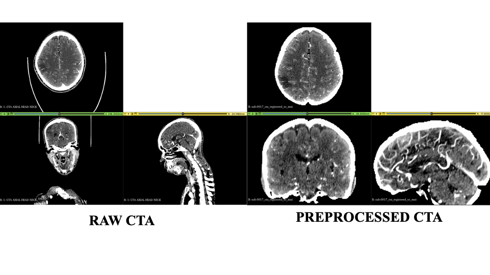

# Introduction

This is the supporting code for the academic paper "Machine Learning Based Prediction of Unexpected Outcome after Successful Endovascular Stroke Therapy"

Author List: Jerome A Jeevarajan, MD*, Yingjun Dong, PhD*, Anjan Ballekere, MS, Sergio Salazar Marioni, MD, Arash Niktabe, BS, Rania Abdelkhaleq, BS, Sunil A Sheth, MD, Luca Giancardo, PhD
* Co-first authors

[curently under review]

Many patients with acute ischemic stroke (AIS) due to large vessel occlusion (LVO) undergo endovascular stroke therapy (EST) but still do not have a good clinical outcome despite having a small final infarct volume (FIV). This is unpredictable with our current understanding of LVO AIS, and we hypothesize that a machine learning-based approach could accurately predict who will have an unexpected poor outcome among a cohort of patients with successful EST and FIV less than 30 mL. 

From our prospectively maintained multi-center registry, we identified consecutive LVO AIS subjects who underwent EST with successful reperfusion defined as TICI 2b to 3. We included only subjects with FIV < 30 mL and recorded 90-day outcome (modified Rankin scale, mRS). A deep learning model was pre-trained and then fine-tuned to predict 90-day mRS 0-2 using computed tomography angiography images (DSN-CTA model). The model was fine-tuned and tested using repeated bootstrapped cross-validation. The primary outcome was the predictive performance of the DSN-CTA model compared to a model with clinical variables only, measured by the area under the receiver operating characteristic curve (AUROC). 

The DSN-CTA model was pre-trained on 1,542 subjects and then cross-validated with 48 subjects, all of whom underwent EST with TICI 2b-3 recanalization. Among the fine-tuning cohort, average age was 66.8 years old, 60.4% were female, and median NIHSS was 15 [IQR 10-19]. Of this cohort, 56.2% of subjects had 90-day mRS 3-6 despite successful EST and FIV < 30 mL. The DSN-CTA model showed significantly better performance than clinical variables alone when predicting good 90-day mRS (AUROC 0.81 vs 0.557, p=0.014). 

The prediction task is binarized as follows:
 
Patients with small FIV (< 30 mL) with mRS 3-6 and premorbid_mrs < 2  (unexpected outcome, cases)
vs
FIV < 30 with mRS 0-2 (expected outcome, controls)

# Usage
## Create environment
Install conda

Please see official doc https://conda.io/projects/conda/en/latest/user-guide/install/index.html.

Create virtual environment

`conda create -n smallfiv python=3.10`

`conda activate smallfiv`

To clone all files:

`git clone https://gitpapl1.uth.tmc.edu/ydong4/smallfiv_mrs.git`

`cd smallfiv_mrs`

Install required package:

`pip install -r requirements.txt`

To add input files, please make modifications in `config.py`.

## Image Preprocessing:

Please reference to our GUI: https://github.com/lgiancaUTH/preproc__cta_core/ for image preprocessing. Saving path for preprocessed nifti brain images is in `config.py` named as `BRAIN_NIFTI_PATH`

To obtain numpy file from NIFTI and make it fit for DeepSymNet v3, please use script named `get_npy_from_nifti.py`

Example for preprocessed image see

## Pretrained Model:

The pretrained model is similar to our group's previous work by [Pachade et al.](https://ieeexplore.ieee.org/abstract/document/10230623).

Image Encoder: [DeepSymNet v3](https://www.sciencedirect.com/science/article/pii/S2213158223000517)

Text Encoder: [DistillBERT](https://arxiv.org/pdf/1910.01108)

Structure: [CLIP](https://arxiv.org/pdf/2103.00020)-Based Loss Model

Pretrained Subjects: 1542 patients with 3D CTA images and radiologists' reports Impression

## Input Files:

In our fine-tuning experiments:

Train / Test Split Ratio: 8 to 2

train/test_{ti}time_{n}fold.csv: n means Nth Fold, ti means TIth times.

## Prediction Results:

Run 5-fold cross validation 5 times

`python run_inference.py --ti 5 --fold 5`

The results will be written to `output_probs/auc_5fold_{ti}time.csv`. Those csv files contain all of testing subjects' probabilities and label.

Then, using `calculate_auc.py` to get average AUC score.

## Run an Example:

1. Change image path in config.py

`IMG_PATH = 'input_img/example.npy'`

2. Run inference.py

`python inference.py --ti 0 --fold 1`

# Acknowledgement
This work is supported by the NIH NINDS R01NS121154. If you find this code useful, please consider citing our paper. 

Initial code development led by Yingjun Dong, PhD

# Disclaimer
This tool is experimental and for research purposes only and is not intended for diagnostic use or medical decision-making. This is prototypes and has not been approved by the FDA.

This software is free to use for non-commercial purposes only.